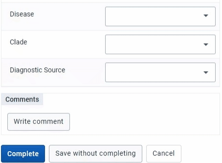
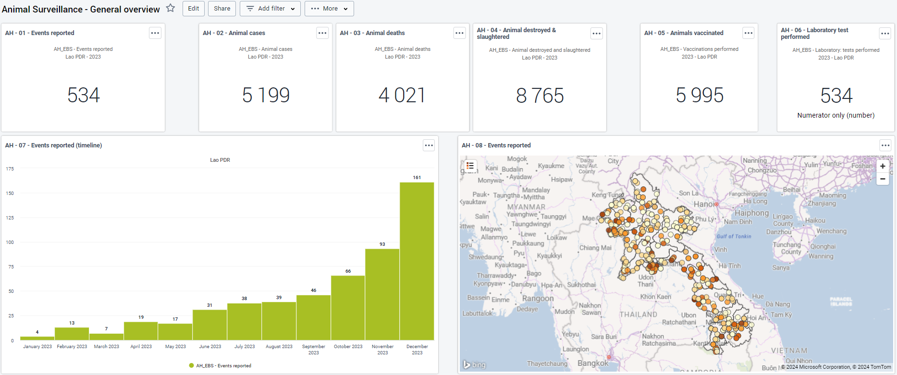
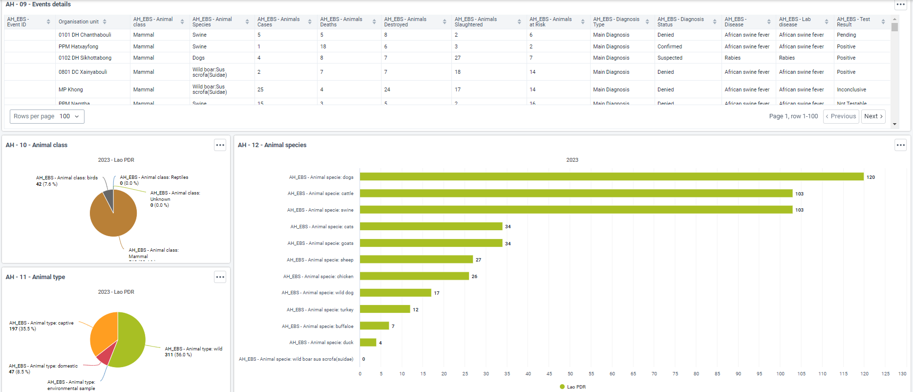
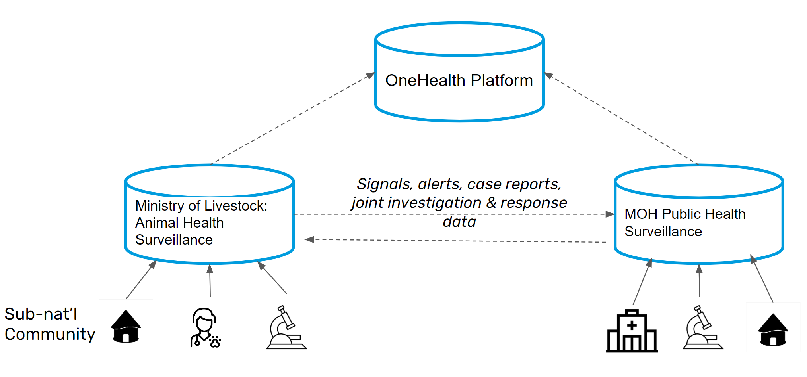
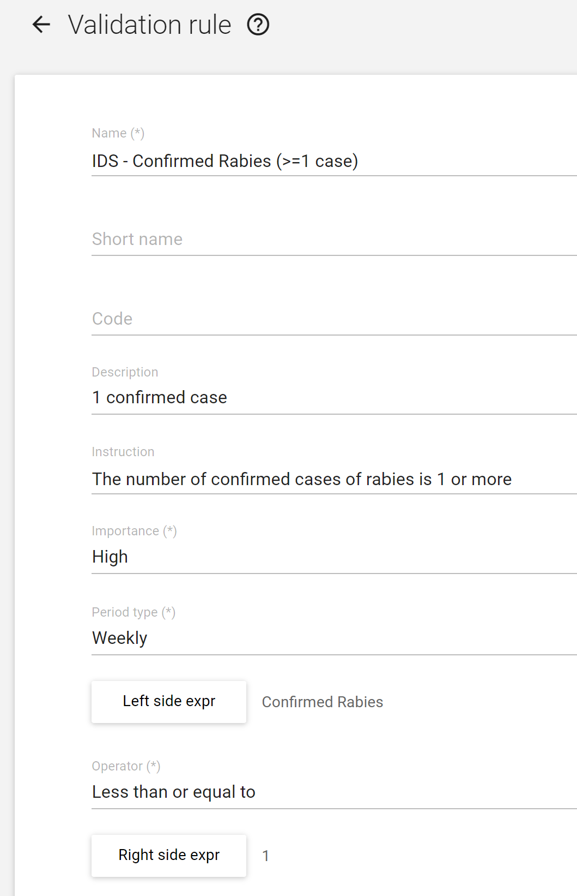
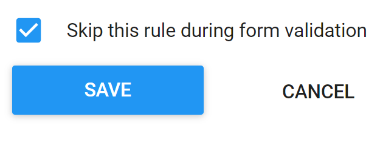
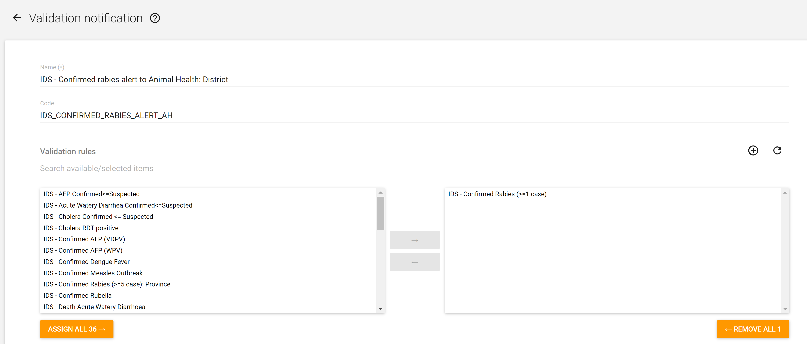
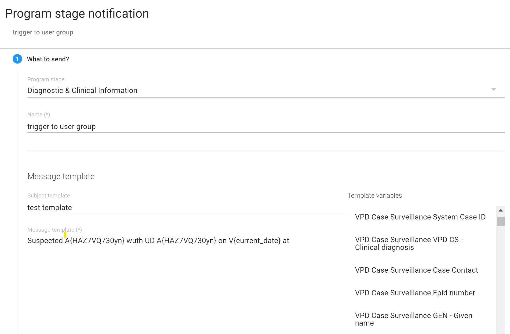
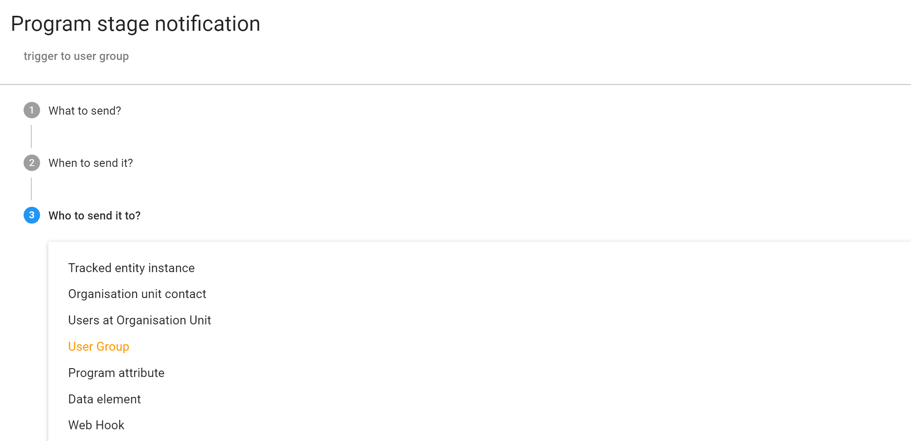

# Animal Health - Event Based Surveillance design { #ah-ebs-design }

## Introduction

An estimated 60% of emerging infectious diseases originate in animals, both domestic and wildlife ([WHO, 2023](https://www.who.int/news-room/fact-sheets/detail/one-health)). The high risk of zoonotic spillover into human populations demands close collaboration, communication and coordination between animal and public health sectors. While substantial investments and resources have helped public health agencies and MOH in countries to strengthen surveillance systems for humans, the resources available for improving animal health surveillance remain far more limited.

The **DHIS2 Animal Health toolkit** is designed for implementation by Ministries of Agriculture & Livestock to improve routine, systematic surveillance in animal populations, thanks to catalytic support from CDC’s Center for Global Health. A DHIS2 tracker program for animal health event based surveillance is described in this document. The animal health tracker program is based on the design of [FAO’s EMPRES-i system]([https://EMPRES-i.apps.fao.org/](https://empres-i.apps.fao.org/)) for global reporting and early warning. Metadata published as a part of this toolkit is aligned with the FAO recommended metadata for early warning systems to facilitate ease of interoperability between DHIS2, EMPRES-i and other systems. The DHIS2 system for animal health can operate as an independent surveillance platform for Ministries of Livestock and actors working in veterinary and animal health; or it can be integrated into a DHIS2 platform alongside public health surveillance data to enhance data sharing for zoonotic diseases.

Recognizing that the health of humans, animals, plants, and the wider environment are closely linked and interdependent, the One Health approach emphasizes cross-sectoral collaboration at all levels to protect our ecosystems and address health challenges like the emergence of infectious diseases, antimicrobial resistance, and food safety ([WHO](https://www.who.int/health-topics/one-health#tab=tab_1)). The animal health toolkit builds upon lessons learned from more than a decade of implementing public health surveillance systems in DHIS2 with 40+ Ministries of Health and aims to further advance collaborative, cross-sector approaches to improve health for all. These efforts are in line with the WHO’s [collaborative surveillance framework](https://www.who.int/publications/i/item/9789240074064) to strengthen the global architecture for health emergency preparedness, response, and resilience (HEPR).

>**Note:**
>
>For more information about One Health use cases with DHIS2, visit our webpage: [dhis2.org/one-health](https://dhis2.org/one-health/)

### Acknowledgements

The DHIS2 animal health toolkit was supported by CDC funding through the OneHealth initiative. HISP Centre is grateful to CDC, Food & Agricultural Organisation (FAO), World Organisation for Animal Health (WOAH) and the World Health Organization (WHO) for contributing their technical expertise and guidance in the development of the toolkit.

## System Design

### Architecture

The DHIS2 Animal Health Toolkit is designed to:

- Enable the use of DHIS2 at country, subnational and community levels to serve as an electronic platform for routine surveillance of animal health and possible health events related to animal populations
- Facilitate reporting of possible animal diseases and animal health events and allow authorities to review and verify events reported from the community and other sources
- Link laboratory results and response measures to reported animal health events where relevant and available
- Provide access to veterinarians and epidemiologists to information about animal health events to analyze, assess and initiate response measures or notifications to global agencies as needed
- Facilitate the sharing of information of information on animal health with the public health sector (and vice versa) to improve cooperation for detecting zoonotic disease threats

Based on landscaping of existing country systems for One Health and animal health, there are multiple scenarios for implementing DHIS2 to support animal health surveillance functions. The animal health toolkit is designed to be flexible and adaptable based on existing country systems and architecture.

### Use Case

#### Early warning systems for animal health

This design document focuses specifically on using DHIS2 to report and collate information related to animal health threats. These data can then be shared upstream to other systems, such as national One Health platforms, FAO’s EMPRES-i system for early warning, or sending key data to DHIS2 surveillance systems managed by the Ministry of Health to alert public health staff to possible zoonotic disease threats.

The DHIS2 tracker program presented here is designed to support early warning and borrows principles from event-based surveillance approaches. Event-based surveillance aims to detect unusual events, illnesses, deaths or other occurrences that might signal a possible outbreak [CDC](https://www.cdc.gov/globalhealth/healthprotection/gddopscenter/event-based-surveillance.html).

Event-based surveillance can incorporate many types of sources, including publicly available and unstructured data. In this use case, we focus primarily on the use of DHIS2 for:

- **Community-based reporting** of information about a possible public health event is reported by people in the community through a hotline or other messaging system, such as by farmers, community health workers, community members, para-veterinarians, etc.
- **Health facilities**: reporting unusual or unexpected events with patients presenting at facilities, or clusters of unusual conditions.
- **Veterinarians, agriculture and livestock workers** who have frequent contact with domestic and sometimes wildlife

These “events” can include signals, such as those reported from the community, which are verified by qualified surveillance personnel. For example, a farmer may report an unusual occurrence of a cluster of dead animals, which prompts local health authorities to verify and investigate whether there is a possible health threat. Reporting from veterinarians, community members, agriculture and livestock workers is especially important for detecting possible events that can result in the spread of zoonotic diseases.

#### Personas (System Users)

The Animal Health surveillance system design focuses on meeting the needs of end users at all levels of the animal health system, including those responsible for implementing and managing integrated platforms as One Health. These users may include:

- **Animal health surveillance officers (national & sub-national)**: data users who are responsible for data collection, routine analysis of data, using data to improve operations and programme strategies, and providing data-driven feedback to programme staff
- **Animal health surveillance data managers:** users who are responsible for overseeing data collection, management, data quality, analysis and reporting functions for the national animal health surveillance department
- **System admins:** Core DHIS2 team responsible for maintaining and improving data systems for animal health programmes, integrating data streams collected with separate tools as EMPRES-i into national platforms, providing technical support for system design, adaptation and end user support; and maintaining the DHIS2 system over time.
- **Cross-sector platform users:** users from different domain such as human health and environment may need access to the animal health surveillance data for cross-sector analysis under the One Health approach
- **Implementing partners:** organisations who provide technical assistance to the national animal health surveillance platform, collect and analyse data on behalf of the overall national strategy, and may be responsible for the operations of service delivery networks.

### Key Components & Functionality

The DHIS2 Animal Health Surveillance system has two main components:

- **Tracker program:** a DHIS2 tracker program has been configured for event-level data collection based on early warning data variables captured by FAO’s [EMPRES-i]([https://EMPRES-i.apps.fao.org](https://empres-i.apps.fao.org)) system.
- **Dashboard:** a standard dashboard with maps and charts to visualize the distribution and frequency of various types of animal health events reported, as well as types of animals affected, confirmed diseases and other data.

The DHIS2 tracker program provides a basic structure for capturing key data according to global recommendations. It can support direct reporting of animal health surveillance in DHIS2, such as by community health workers and veterinarians using mobile applications. Alternatively, the tracker program structure can be used to simply collate data collected in other systems to improve accessibility and analysis. The standard tracker program may be adapted for local workflows depending on the level of data entry, types of users and levels of verification or approval of the data.

Additional DHIS2 functionalities can further enhance the use of the system. These include:

- **DHIS2 Android application** for mobile data collection, including offline data collection in the field or by community workers
- **Customizable notifications**: notifications can be configured based on conditions to automatically send messages and alerts to users. This can be accomplished by email, DHIS2 message widget, or SMS when the DHIS2 SMS gateway is configured. For example, a confirmed case of zoonotic disease in animal populations can trigger a message to district level public health surveillance staff to alert local facilities and initiate a joint investifation.
- **Configurable workflows**: depending on whether the DHIS2 Tracker program is used at a centralized level (national or district level data entry) or in a decentralized workflow (such as community workers sending initial signals/reports that are triaged and verified by surveillance staff and investigated by surveillance teams), countries can rearrange the order of the program stages and data variables, and assign different access to individuals or groups of users for viewing and editing data.

#### Interoperability and Data Exchange

As a robust platform for interoperability with a well-documented REST-based API, the DHIS2 system facilitates upward reporting from DHIS2 to global databases such as EMPRES-i or WOAH’s WAHIS system; alternatively, DHIS2 can be used simply to receive and store animal health surveillance data as a repository from other existing data collection tools. This capability allows DHIS2 to bring data together from animal and public health sectors (and beyond!) to enhance prevention and early detection of zoonotic spillovers and diseases.

## Tracker

The tracker program structure is as follows, favoring simplicity in the number of program stages. These can be further adapted according to country workflows.

| **Stage**              | **Description**                                              |
| ---------------------- | ------------------------------------------------------------ |
| Enrollment             | The enrollment stage collects the basic information related to the health event reported such as the event ID, observation date, name and contacts of the farmer affected and location. The Tracked Entity Type for the Animal Health program is “Health Event''. **The stage is non-repeatable: a signal or event is expected to be reported once and tracked over time.** Any subsequent event would be considered its own TEI in DHIS2. |
| Epidemiology           | The stage is automatically generated after the enrollment as collecting key information on the epidemiological situation of the event such as the animal characteristics with the relative amount of animals affected, the clinical signs and necropsy lesions, surveillance type and infection source.**The stage is repeatable** |
| Diagnosis              | The stage collects information related to the diagnosis, type, status and disease classification. **The stage is repeatable** |
| Laboratory             | The stage collects information on the laboratory that is analysing the sample, sample identification and test details. A unique lab ID is included in this stage to allow the linkage of samples and results. **The stage is repeatable** because multiple samples can be taken, and multiple lab tests and results can be available for a given sample. |
| Measures and treatment | The stage collects information on the treatment provided in the health event and the control measures implemented. **The stage is non-repeatable** as it is intended to include all response measures provided for the animal health event. |

### Tracked Entity Type

The DHIS2 Animal Health surveillance tracker program allows for the enrollment of a tracked entity type (TET) ‘Health event’. We have made this conceptualization based on CDC’s definition and the overall flow of the early wearing system. In this context, an event is a manifestation of disease or an occurrence that creates a potential for disease, which can include infectious, zoonotic, food safety, chemical, radiological, or nuclear in origin and may be transmitted by persons, vectors, animals, goods, or through the environment [CDC](https://www.cdc.gov/globalhealth/healthprotection/gddopscenter/event-based-surveillance.html).

Defining what constitutes a “Health Event” or determining a more suitable terminology should be decided at country level with stakeholders. The terminology here is intended to be as generic as possible, but in practice this can have different interpretations such as a delimited geographical unit or a group of individuals (humans or animals) which are all affected by the same pathogen, or with the same syndromic characteristics..

### Enrollment

When a new possible animal health “event” is enrolled in the Animal Health program as a Tracked Entity Instance (TEI), Tracked Entity Attributes (TEA) are recorded to form the event profile.

The *enrollment date* is conceptualised as the “reported date”, signifying the date that the signal or event was initially reported (e.g. by a community member, veterinarian, farmer, or other authority).

The attribute *Event ID* is an unique ID automatically generated using the textPattern SEQUENTIAL(#######) syntax and need to be customised prior to implementation depending on local context. The Event ID is configured as searchable to allow users to search for an event that was reported and is automatically generated. The system generated unique ID allows for the event to be tracked throughout the course of investigation, lab data, response, etc.

The attribute *observation date* refers to the date in which the health event has happened and can be used to monitor the quality of the surveillance system comparing with the TEA “Reported date”ing

The attribute *General Comment* is used to collect descriptive, non-structured information about the event. This can provide key context for veterinary epidemiologists, surveillance officers and other experts to triage and verify the signal for further investigation.

### Stage 1: Epidemiology [repeatable]

This stage is auto-generated upon enrollment of the initial event report (such as when an animal surveillance event was initially reported by a community member, veterinarian, farmer or other user). This stage records basic epidemiological information about the animal health event.

>**Note:**
>
>The stage is repeatable because it is intended that the user will complete this form for each animal species affected. For example, if a farmer notices an unusual cluster of deaths in both pigs and chickens at his farm, the form should be completed for each animal species.**

#### Epidemiology

In the sections basic qualitative and quantitative epidemiological information are collected about the animal species, the amount of animals involved and the production system.

The options in the data element *Animal Species* are populated by Option Groups. A set of Program Rules based on the value selected on the DE *Animal class* narrows down the list of options based on a hierarchical relationship between the animal class and animal species.

Note that in this use case, the *Production System One* encompasses various animal rearing and management practices based on the specific environments and purposes for which animals are kept. These categories reflect the diverse contexts of animal husbandry, ranging from small-scale, informal setups to specialised facilities. It does *not* refer to the production system in the sense of information systems.

The data element *Production System Two* categorises animal production based on the primary purposes and operational characteristics associated with different types of animal husbandry. This system focuses on the specific production goals, such as meat, egg, or wool production, as well as the various market and management practices involved.

#### Clinical signs and necropsy lesions

Multiple clinical signs and necropsy lesions can be entered here. By default, the program is designed to capture up to five (5) signs/lesions; the possibility to add more will require a set of additional data elements and program rules.

Each grouping of five data elements (for *Clinical signs* and *necropsy lesions*, respectively) share a common option set.

#### Surveillance and Infection source

This program section captures the type of surveillance performed and the infection sources.

Multiple possible sources of infection can be entered here; up to five have been preconfigured and more can be added with a set of additional data elements and program rules.

#### Comments

In this program stage section, users can add free text to provide additional commentary and contextual information. This is particularly useful for event-based surveillance when an unusual occurrence is detected and qualitative information is required for local authorities to verify the signal as an event.

### Stage 2: Diagnosis [repeatable]

In this stage the main information the diagnosis type, basis status and disease type are collected. The stage is repeatable as it is recommended by veterinary experts that there can be one main diagnosis, as well as several differential diagnoses. The type of diagnosis (main or differential) is specified in the data element *Diagnosis type*.

Through a set of program rules and a hidden data element, once the option *Main diagnosis* is selected for the data element *Diagnosis type* in an event, the only option available in subsequent selections will be *Differential Diagnosis*. This prevents the possibility of the user accidentally entering more than one main diagnosis for a given health event (DHIS2 enrollment).

 

In case a laboratory confirmation is available, the user will need to update the *Diagnosis Status* once they receive the result from the laboratory that will either confirm or deny the suspected diagnosis.

The *Disease Subtype* is visible only for a specific set of diseases and the options are populated by Options Groups and a set of Program Rules based on the subtype selected.

### Stage 3: Laboratory data [repeatable]

The program stage event date is conceptualised as the “reporting date”, signifying the date when the laboratory data was entered. This program stage is configured as repeatable to allow for multiple laboratory tests and laboratory results to be added to the record. The inclusion of a *Sample ID* data element allows multiples tests or results to be linked to a given sample.

#### Laboratory information

The data element *Laboratory* contains an option set collated by FAO in its Empres-i system. It contains national reference labs as well as international labs. Countries may need to update this option set to include the appropriate laboratories available in their country for testing. This field allows users, particularly at national level, to know which laboratory is analysing and providing results on the sample.

#### Sample identification

Information on the ID, disease and affected species of the sample. The ID of the sample is fundamental for the correct data management and association sample - event and the variable selected for the disease and affected species need to coincide with the ones selected on the Epidemiology and Diagnosis stages.

#### Sample and test details

This section collects information on the test and date of sampling and result. This can be reported by the lab itself, or by a surveillance officer or other responsible person at national level. Data elements of type ‘date’ are available to capture the *Sampling date* and *Result date* (when lab results were made available) which will allow further time-based analyses such as time between the reporting of an event and the availability of a lab result.

### Stage 4: Control measures and treatment [non-repeatable]

The control measures and treatment stage is non-repeatable as all the actions taken are intended to be recorded after the response to the health event (DHIS2 enrollment). This can be adapted according to local context if real-time data entry on various types of control measures are entered in real time.

Multiple possible sources of *Control Measures* and *Treatments* can be entered here. Similarly as *Clinical Signs* data elements, these are represented as five cloned data elements that share the same option set. Additional data elements and program rules can be added if desired.

### Data Elements

All data elements configured for the Tracker domain are also included in the Data Element Group ‘Animal Surveillance’ [iMNcm8NLZSJ]. This serves as a de facto DHIS2 data dictionary for the Animal Surveillance tracker use case. It allows for the data elements to be exported from DHIS2 and used independently of the Tracker program configuration, for example in the case that an implementation redesigns their Tracker from scratch for local workflows and still wants to use the metadata aligned with the FAO-recommended data variables.

>**Caution:**
>
>Data elements configured for this package are aligned to the version of EMPRES-i dated February 28, 2024. The EMPRES-i data dictionary and metadata may evolve over time, requiring updates, maintenance or re-mapping for countries that implement data exchange solutions.

#### Cloned data elements for multiple option selection

Within the program stages for ‘Epidemiology’ and ‘Measures and treatment’, there are a number of data elements that are cloned to allow the selection of multiple options for a given concept, sharing the same option set. This design is implemented as follows:

- Cloning of data elements eligible for multi-option choice
- The number of clone of the data element must be the same as the number of options present in the related option set
- Each cloned data element has its own UID, name and code
- Program Rules
- Hide the consequent Data Elements if the previous have not been selected
- Show error in case the same Option has been selected more than once in the same group of Data Elements

## Analytics

An animal surveillance [dashboard](https://demos.dhis2.org/hmis/dhis-web-dashboard/#/FHh9NTsTjQY) has been developed based on experience gathered from countries implementations and reports used by international actors such as FAO and WOAH. Dashboards are primarily represented using program indicators, which have been configured to aggregate numbers based on conditions recorded in the tracker program.

### Summary of events, cases, deaths reported by time and geographical distribution

### Line-listing and animal classification

### Diagnoses and confirmed cases

### Lab test results, type, control measures and treatments

## User Groups

The following user groups are included in the downloadable metadata file:

| **User group**        | **Metadata**      | **Data**             |
| --------------------- | ----------------- | -------------------- |
| AH_EBS - Admin        | Can edit and view | No Access            |
| AH_EBS - Access       | Can view only     | Can view only        |
| AH_EBS - Data Capture | Can view only     | Can capture and view |

## Notifications

Early detection and response to zoonotic disease events can be enhanced by sharing relevant surveillance data between animal and public health sectors. How can DHIS2 trigger and generate alerts based on what, when and where a possible health event is occurring? In this section, we describe how to configure and use core DHIS2 functionality to improve information sharing between these sectors. 

Notifications features in DHIS2 support the automation of alerts and information sharing from DHIS2 based on pre-configured conditions or rules. These features allow you to:

- Configure conditions and expressions for triggering a notification or outbound communication based on what, when & where: notifications can be generated based on combination of factors such as aggregate or tracker domain data, geographic level (org unit level), user groups, time period, fixed variables and other elements. 
- Assign users or groups of users at different administrative levels to receive notifications based on the conditions and rules defined
- Customize messaging templates with fixed and variables parameters to provide concise information and recommended actions to target recipients based on what type of health event occurred, when and where 
- Automate sending notifications from the system to defined user groups
- Set up mechanisms for sharing the notification such as by email or SMS or interoperability with other tools like Rapid Pro

*Figure: cross-sector surveillance system interactions for zoonoses*

### Use Case

In the context of One Health and sharing surveillance and early warning data between animal and public health sectors, setting up notifications in DHIS2 depends on how DHIS2 is used in the country context, who is managing the system (e.g. MOH, Ministry of Livestock, One Health desk), what data are captured, and what protocols are in place for notifications and cross-sector information sharing. Here we provide three illustrative examples depending on how DHIS2 is being used in the country:

**Use Case A**: DHIS2 is used for *public health surveillance data* (such as eIDSR). Alerts and notifications can be triggered from the public health sector to users or actors in the animal health sector. Example: if a threshold for suspected rabies cases in humans is surpassed, a notification can be sent to the district veterinary officer; a hospitals reports a suspected case of anthrax which is later confirmed by the lab and should be notified to the national One Health desk. 

For the public health surveillance use case, please see the documentation on incorporating outbreak alerts and notifications:

- [Aggregate IDSR design](https://docs.dhis2.org/en/implement/health/disease-surveillance/ids-aggregate/design.html#validation-notifications)
- [Case-based surveillance (tracker) design](https://docs.dhis2.org/en/implement/health/disease-surveillance/vpd-case-surveillance/design.html#notifications)

**Use Case B**: DHIS2 is used as an *early warning system for animal health* (as in the Animal Health design guide). Alerts and notifications can be triggered from the animal health sector to the public health sector. Example: an outbreak of brucellosis has been detected in a nearby cattle population; health workers at nearby health facilities receive a notification so that they can be more vigilant in screening for symptoms in patients. 

**Use Case C**: DHIS2 is used as an *integrated event-based surveillance (EBS)* or event management platform. Alerts and notifications can be parsed based on the data captured and redirected for signal triaging and verification. Example: a CHW reports an unusual cluster of dead cows near their village using the DHIS2 mobile app which triggers an alert to the veterinary officer; a CHW reports dog bites from a suspected rapid animal and an alert is sent both to nearby health facilities and to the district veterinary officer.

### Configuration workflow

In this section, we provide practical examples and a workflow for customizing notifications in DHIS2 for the use case of sharing data from DHIS2 with actors in animal and public health sectors. These features allow you to define what information to share with which types of actors, under which conditions, and how the information should be disseminated. 

For tracker data, the [program notifications](https://docs.dhis2.org/en/use/user-guides/dhis-core-version-master/configuring-the-system/programs.html#create-a-program-stage-notification) feature is used. For aggregate data, [validation rule notifications](https://docs.dhis2.org/en/use/user-guides/dhis-core-version-master/configuring-the-system/metadata.html?h=notifications+use#about_validation_rule) are used. 

We recommend that implementers consider and map out the following before follow these steps to define and configure notifications in DHIS2 according to local context:

1. Define the notification protocol: when, what, where, who?
2. Set up user group
3. Configure the validation rule or program stage notification
4. Create the notification message content 
5. Schedule automated jobs
6. Set up the method of delivery
7. Maintenance: users, user groups, scheduled jobs

#### **Step 1: Define notification protocol: when, what, where, who**

Under what condition(s) should the system trigger a notification? To whom? Relevant protocols should be consulted and verified with the actors in both public health and animal health & livestock sectors to define and map the conditions for sending notifications based on data collected in DHIS2 by one sector to contacts in another sector. 

- When: Notification is shared when a specific condition is met, which may be based on:
  - Number of cases: 1 or more
  - Period: weekly, monthly, etc
  - Place: health facility, district, etc
- What: Content of the notification, what variables?
- Where: which levels (facility, district?) should receive a notification -- within or outside their unit/level?
- Who: recipients of the notification - DHIS2 users and non-DHIS2 users

**Example use case example (A)**: DHIS2 is used by health facilities for weekly aggregate IDSR reporting of priority infectious diseases and for immediate case-based reporting of notifiable diseases. These include reporting of several suspected zoonotic conditions like rabies and anthrax which should also be notified to the district veterinary health officer for further investigation. The District Veterinary Officer (DVO) is not a typical DHIS2 user; however, when 1 or more human rabies cases is reported into the weekly IDSR in DHIS2 by any health center, the DVO should receive an email notification.

#### **Step 2: Set up user groups **(and users)

Depending on the notification protocol defined in Step 1, new user groups may be needed. When the target recipients of the notification are already DHIS2 users, simply adding these users to an appropriate user group may be sufficient. If the target recipients are not DHIS2 users, they can be set up users or a user can be set up in DHIS2 to represent listservs that are managed in other platforms. Lastly, if an integration solution is being applied, a dedicated user may be required and should be discussed on a case-by-case basis. To receive e-mail notifications from DHIS2, the user does not need access to other parts of the DHIS2 system. 

**Use case example (A):** District Veterinary Officers (DVOs) are *not* typical DHIS2 users. They only receive notifications from DHIS2, but they are not expected to log in to capture data or to analyze data. A District Veterinary Officer user group is configured in DHIS2 in order to configure and send notifications. A DHIS2 user account for each district is set up with the appropriate access to org units to facilitate notifications to the designated DVO email address, but the user does not have access to capture, view or analyze data in DHIS2. 

#### **Step 3: configure your program notification or your validation notification** 

Based on the conditions defined in Step 1, configure a program notification (for tracker data) or validation notification (for aggregate data and outbreak thresholds). These conditions will depend on the existing configuration and what data is being captured in DHIS2. 

In the *aggregate domain*, validation rule notifications can be configured to trigger an alert when a given disease threshold for a given geographic area and time frame is reached. For more information, **see the [validation rule notifications](https://docs.dhis2.org/en/use/user-guides/dhis-core-version-master/configuring-the-system/metadata.html?h=notifications+use#about_validation_rule) documentation.** Remember that you may first need to create your validation rule to establish the condition for a threshold.

In the *tracker domain*, program notifications and program stage notifications can trigger a notification based on a flexible range of variables captured in the DHIS2 tracker program. For more information, **see the [program notifications](https://docs.dhis2.org/en/use/user-guides/dhis-core-version-master/configuring-the-system/programs.html#create-a-program-stage-notification) documentation. **Remember that you may need to first create a program rule to establish the condition. 

**Example use case (A): Validation Notification**

We want to configure an alert to the District Veterinary Officer when 1 or more human rabies cases is reported in the weekly aggregate IDSR dataset.

1. Create a validation rule to represent the condition for your threshold. In this case, assign the data element on the left hand side operator as 'Rabies cases', the operator as less than, the right hand side as 1. When the time period is set to one week and the org unit is set to Facility Level, the rule will allow a notification to be triggered any time a facility that reports more than one rabies case in a given weekly period. 

*Tip: Remember to tick the box 'Skip this rule during form validation' if you do not want this rule evaluated during data entry!*

2. Create a validation rule notification. 

Select your desired validation rule ("under what condition will I send a notification?")

Select the desired recipient user group ("who will receive this notification?")

**Example use case (A): Program Notification**

We want to configure an alert to the District Veterinary Officer when a suspected rabies case reported in a case-based tracker program receives a lab confirmation. 

1. Select the program whose data will trigger a notification. In this case, we are using a program stage notification because we want to use the values of the option set lab results collected as a data element in the Lab Results program stage to trigger our notification. 
2. Configure "what to send" using the notification message content (also described in Step 4). 

3. Configure "when to send" the notification.  In this case, we want to trigger based on an existing program rule that filters events with a confirmed lab results. 

*Tip: Remember you may need to configure a program rule first, using the ProgramRuleActionType.SENDMESSAGE to make this trigger successful.*

4. Configure "who to send it to". Select user groups, users assigned to the org unit, or other parameters as relevant (for example, web hooks can support interoperability with other messaging tools). In this case, we will send it to the user group 'District Veterinary Officers', restricting the notification only to the parent org unit. This is because we want to send the notification to a user at the District level for a case reported at any facility within the parent district in the DHIS2 OU hierarchy. 

*Tip: You can also decide whether to only notify users in the hierarchy; or only the parent org unit (for example: a district in Case X should only be sent to users at its parent Province Y)*

#### Step 4: Create notification message content

When configuring the validation notification or a program notification, you will set your notification message template. 

*Tip: ensure your message notification template includes action points and reminders to the target user based on local protocols.* 

Template variables can be used to generate dynamic messages based on parameters such as organisation unit, current date, and period. 

*Figure: Template variables for validation rules*

Template variables render dynamically in the message to the target user. In this example, we can see that the rabies cases were reported from Mahosot Hospital (reporting org unit) in epi Week 28 2024 (based on weekly data set). 

#### Step 5: Schedule automated jobs

Several jobs need to run in sequence in order to automate validation notifications (these can also be run manually). See the [documentation for scheduling](https://docs.dhis2.org/en/implement/health/disease-surveillance/ids-aggregate/installation.html#idsr-scheduling) and sequencing jobs to automate this process. 

#### Step 6: Set up the delivery method

Recipients of notifications triggered by DHIS2 may or may not be users with access to other parts of the system. Core DHIS2 functionality supports the following mechanisms for notifications:

- DHIS2 internal messaging service
- SMS (by setting up an [SMS Gateway](https://docs.dhis2.org/en/use/user-guides/dhis-core-version-master/maintaining-the-system/configure-sms.html)) or USSD
- Email (emails of DHIS2 user accounts, see more information on [setting up email](https://docs.dhis2.org/en/use/user-guides/dhis-core-version-master/configuring-the-system/system-settings.html#system_email_settings))

More robust and complex notifications workflows or support for other types of communications platforms can be achieved through [integration](https://dhis2.org/integration/) with DHIS2 and other tools such as:

- Rapid Pro (see [video](https://www.youtube.com/watch?v=Yvkvyefa3fo) and [code](https://github.com/dhis2/integration-dhis-rapidpro))

- Chatbots and social media platforms (see [video](https://www.youtube.com/watch?v=L35svQE42Qo))
- Other innovations leveraging the DHIS2 API and other extensibility features like web hooks 

#### Step 7: Maintenance

A system administrator should be designated to maintain the solution over time. This can typically be managed by the core DHIS2 team at the Ministry or similar:

- Maintain user accounts and user groups (coordinating with animal health sector for up to date rosters/contacts: create new users, assign to user group, deactivate users)
- Continue to monitor that scheduled jobs run as expected, in sequence
- Configure new notifications, messages, conditions and user groups based on new requirements (such as priority disease conditions and thresholds) and changes in notification protocols
- During DHIS2 upgrades: test functionality for your configuration 
